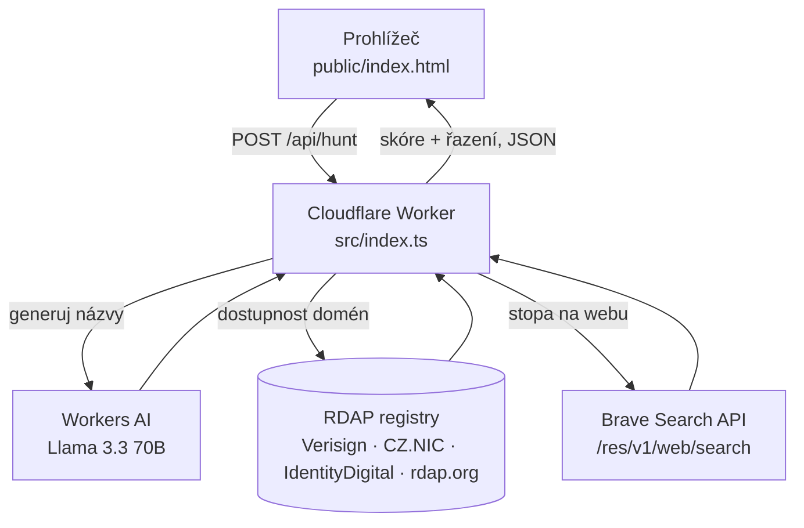

# domlov — technická dokumentace k oponentuře

> **Projekt:** domlov — lov volných domén + generátor značkových názvů
> **Autor:** Milan Trnka
> **Stav:** nasazeno v produkci, ověřeno naživo
> **Živě:** <https://domlov.bass443.workers.dev> · **Repo:** <https://github.com/Anamax443/domlov> (public)
> **Dokument aktuální k:** 2026-07-20, commit `1f5574a`

Tento dokument slouží jako podklad k oponentuře: shrnuje zadání, architekturu, **zdůvodnění klíčových
rozhodnutí**, skórovací model, způsob ověření, známé limity a kompromisy. Cílem je, aby oponent
dokázal řešení posoudit a ověřit bez čtení celého zdrojového kódu.

---

## 1. Zadání a motivace

**Problém.** Při zakládání firmy / aplikace / projektu je časově náročné najít název, který je zároveň:
1. dostupný jako doména (hlavně `.com` a `.cz`),
2. dostatečně unikátní — nezahlcený existujícími značkami a produkty na webu.

Ruční postup (vymyslet jméno → ověřit doménu u registrátora → vygooglit) je pomalý a opakovaný.

**Cíl.** Nástroj, který na jedno zadání („zaměření firmy") vygeneruje sadu značkových názvů a u každého
**současně** vyhodnotí dostupnost domén a stopu na webu, seřadí je podle kombinovaného skóre a nejlepší
zvýrazní. Ideál = volná `.com`/`.cz` + minimální výskyt jména na webu (referenční příklad: „faxxar").

**Cílový uživatel.** Jednotlivec zakládající projekt/značku; interní použití, nízký objem dotazů.

---

## 2. Rozsah řešení

| V rozsahu (MVP) | Mimo rozsah (vědomě) |
|---|---|
| Generování značkových názvů z volnojazyčného zaměření (i česky) | Automatická registrace domén |
| Dostupnost domén přes RDAP pro 7 TLD | Cenové porovnání registrátorů |
| Stopa jména na webu (heuristika) | Ochranné známky / rešerše ÚPV/EUIPO |
| Kombinované skóre + řazení | Perzistence historie hledání, uživatelské účty |
| Rychlá kontrola konkrétního názvu | SEO analýza, sociální sítě (dostupnost @handle) |
| Dvojjazyčné UI (CZ/EN), dark/light, tisk | Mobilní nativní aplikace |

Vědomá rozhodnutí o hranicích rozsahu jsou obhájena v sekci 9 (Limity a kompromisy).

---

## 3. Architektura

Jeden **Cloudflare Worker** (TypeScript) plní dvě role: servíruje statický frontend a obsluhuje `/api/*`.
Řešení je **bezstavové** — žádná databáze, žádná perzistence; vše se počítá za běhu z externích služeb.



### Komponenty
| Soubor | Role |
|---|---|
| `src/index.ts` | Worker: router + jádro (RDAP, AI generátor, web stopa, skóre) |
| `public/index.html` | Celý frontend (HTML+CSS+JS v jednom), AXIMA UI standard archetyp A |
| `src/version.json` | commit / branch / čas buildu (razítkuje `scripts/stamp-version.mjs`) |
| `wrangler.jsonc` | konfigurace Workeru + bindingy `AI`, `ASSETS` |

### API
| Endpoint | Metoda | Vstup → výstup |
|---|---|---|
| `/api/version` | GET | `{commit, branch, builtAt}` |
| `/api/health` | GET | `{ok, ai, web}` — stav služeb |
| `/api/hunt` | POST | `{theme, count, tlds}` → generuje názvy a hodnotí je |
| `/api/check` | POST | `{name, tlds}` → hodnotí jeden konkrétní název |
| `/*` | GET | statický frontend (binding `ASSETS`) |

### Datový tok (hunt)
1. Frontend pošle `POST /api/hunt {theme, count, tlds}`.
2. **Workers AI** vygeneruje kandidáty → normalizace (malá písmena, bez diakritiky, dedup). Pojistka:
   při selhání AI naskočí algoritmický `fallbackNames`.
3. Pro každý název **paralelně**: RDAP dostupnost per TLD + Brave web stopa.
4. **Skóre** = kombinace dostupnosti domén a nízké web stopy (viz sekce 5).
5. Seřadit sestupně, vrátit JSON; frontend vykreslí tabulku (nejlepší = ★).

---

## 4. Klíčová technická rozhodnutí a zdůvodnění

Toto je jádro obhajoby — každé rozhodnutí má alternativu, kterou jsme zvážili.

### 4.1 Platforma: Cloudflare Workers (serverless, edge)
- **Proč:** bez správy serveru, globální edge, štědrý free tier (100k req/den), integrované **Workers AI**
  a statický hosting v jednom nasazení. Bezstavovost úlohy (žádná data k uložení) serverless přímo vyhovuje.
- **Alternativy:** klasický VPS/kontejner (zbytečná správa a náklady pro bezstavovou low-traffic úlohu),
  Vercel/Netlify (funkce ano, ale AI generování by vyžadovalo externího poskytovatele + klíč).
- **Kompromis:** limit ~50 subrequestů na jeden request (řešeno v 5.4).

### 4.2 Dostupnost domén: RDAP místo WHOIS
- **Proč:** RDAP je nástupce WHOIS — **strukturovaná JSON odpověď** a jednoznačná sémantika stavu:
  `HTTP 404` = doména neexistuje (volná), `HTTP 200` = existuje (zabraná). WHOIS je nestrukturovaný text
  s per-registr formátem, který by se musel parsovat heuristicky.
- **Autoritativní endpointy** pro klíčové TLD (spolehlivější než bootstrap): Verisign `.com/.net`,
  CZ.NIC `.cz`, IdentityDigital `.io`; zbytek (`.app/.dev/.org`) přes `rdap.org`.
- **Robustnost:** slušný `User-Agent` (bez něj `rdap.org` blokuje → dřív způsobovalo falešné `unknown`),
  1× retry na `429/5xx`/síťovou chybu, jinak stav `unknown`.
- **Vědomé omezení:** `.eu` a `.sk` nemají použitelné RDAP → vynechány, aby se nevracely falešné „volná".

### 4.3 Generování názvů: Cloudflare Workers AI, model Llama 3.3 70B
- **Model:** `@cf/meta/llama-3.3-70b-instruct-fp8-fast` (starší `llama-3.1-8b` byl 2026-05 deprecated).
- **Prompt** cílí na krátká, vyslovitelná, **vymyšlená** slova (neologismy typu „faxxar", „zovix"),
  bez diakritiky, `a–z`. Generuje se `count + 4` kandidátů (rezerva pro dedup a odpad).
- **Robustní parsování:** model občas vrátí čistý JSON, jindy text — parser zkusí JSON pole, jinak rozdělí
  podle nepísmen. Při úplném selhání AI naskočí deterministický `fallbackNames` (kmen zaměření + přípony),
  takže endpoint **nikdy nevrátí prázdno** kvůli výpadku modelu.

### 4.4 Stopa na webu: Brave Search API (klíčový pivot)
Původní návrh počítal stopu přes **Google Custom Search JSON API** (počet výsledků). Během realizace se ukázalo:

- Google **ruší** u Programmable Search Engine volbu „prohledávat celý web": u **nově** vytvořených
  vyhledávačů ji **už nelze zapnout** (ověřeno živě: přepínač hlásí „Podpora funkce byla ukončena"),
  nové vyhledávače zvládají max. 50 domén a **úplný konec celowebového režimu je 1. 1. 2027.**
- Stavět měření webové stopy na dožívající funkci třetí strany je neobhajitelné.

**Rozhodnutí:** migrace na **Brave Search API** (nezávislý webový index, moderní REST).

- Endpoint `https://api.search.brave.com/res/v1/web/search`, autentizace hlavičkou `X-Subscription-Token`,
  kapacita 50 req/s.
- **Metrika:** Brave nevrací celkový počet výsledků. Sílu stopy proto měříme jinak — kolik z **top ~20**
  výsledků reálně obsahuje hledané jméno jako slovo (`\bjméno\b` v titulku/popisu/URL). Vymyšlené unikátní
  jméno → ~0 shod (čisté); běžné slovo / existující značka → mnoho shod. **Méně = lepší.**
- **Graceful degradace:** bez klíče nebo při chybě (např. `429`) se stopa nepočítá (`null`), skóre pak
  vychází jen z domén a aplikace běží dál.

> Tento pivot je zároveň ukázka řízení rizika závislosti na třetí straně: závislost byla **izolovaná**
> (jedna funkce, jeden secret, graceful fallback), takže výměna poskytovatele byla lokální změna, ne přepis.

### 4.5 Frontend bez frameworku
- Jeden `public/index.html` (HTML+CSS+JS), AXIMA UI standard archetyp A (IT-ops). Dark/light/tisk, CZ/EN
  i18n, servisní řádek (health · commit · živé hodiny).
- **Proč:** velikost a složitost úlohy nevyžaduje SPA framework; bez build-stepu = jednodušší nasazení a údržba.

---

## 5. Skórovací model

Skóre je jediné číslo `0–100`, které řadí kandidáty. Skládá se ze dvou složek.

### 5.1 Dostupnost domén (`domainScore`, 0–1)
Vážený podíl volných TLD. Váhy odrážejí obchodní důležitost:

| TLD | `.com` | `.cz` | `.net` | `.io` | `.app` | `.dev` | `.org` |
|---|---|---|---|---|---|---|---|
| váha | 3 | 3 | 1,5 | 1,5 | 1 | 1 | 1 |

`domainScore = Σ(váha volných TLD) / Σ(váha všech kontrolovaných TLD)`

### 5.2 Web stopa (`webScore`, 0–1)
`webScore = clamp(1 − shody / WEB_HEAVY, 0, 1)`, kde `WEB_HEAVY = 12`, `shody ∈ ⟨0; WEB_SAMPLE=20⟩`.
0 shod → `1,0` (čisté); 12 a více shod → `0` (běžné slovo / obsazená značka).

### 5.3 Výsledné skóre
```
skóre = round( 100 × (0,55 × domainScore + 0,45 × webScore) )      # když je web stopa dostupná
skóre = round( 100 × domainScore )                                  # bez web stopy (chybí klíč/chyba)
```
Váhy `0,55 / 0,45`: dostupnost domény má mírnou prioritu (bez volné domény značka nejde použít),
web stopa je silný, ale doplňkový signál unikátnosti.

### 5.4 Ochrana proti limitu subrequestů
Jeden request Workeru smí mít ~50 subrequestů. Hunt proto omezuje počet názvů:
`maxNames = floor(45 / (počet_TLD + 1))`, `count ∈ ⟨1; min(12, maxNames)⟩`. „+1" je právě Brave dotaz.

---

## 6. Bezpečnost a nasazení

- **Secrety mimo git:** `BRAVE_API_KEY` (Worker secret), `CLOUDFLARE_API_TOKEN` (GitHub repo secret).
  Lokálně `.dev.vars` (v `.gitignore`). V repu jsou jen `*.example` vzory.
- **Public repo:** neobsahuje žádné tajemství — pouze kód a dokumentaci.
- **Žádná perzistence** → žádná osobní data, žádná databáze k zabezpečení; minimální plocha útoku.
- **CI/CD:** GitHub Actions (`.github/workflows/deploy.yml`) — push na `main` spustí `wrangler deploy`
  (Node 22). Manuální nasazení: `npm run deploy`. Verze se razítkuje do `/api/version`, takže lze kdykoli
  ověřit, jaký commit skutečně běží.
- **Vstupní validace:** `theme` ořezané na 200 znaků, názvy normalizované na `a–z0–9-` (max 24 znaků),
  TLD sanitizované (jen `a–z`, 2–10 znaků, max 8). Regex pro počítání shod je escapovaný.

### 6.1 Předávání tajemství do CI/CD
Dvě tajemství, dvě různé cesty — vědomě tak, aby žádné nebylo na více místech, než musí:

- **`CLOUDFLARE_API_TOKEN`** (nasazení) = **GitHub repo secret** (Settings → Secrets → Actions). Do workflow se
  injektuje jako proměnná prostředí a `wrangler` ji čte při `deploy`:
  ```yaml
  - name: Deploy to Cloudflare Workers
    run: npx wrangler deploy
    env:
      CLOUDFLARE_API_TOKEN: ${{ secrets.CLOUDFLARE_API_TOKEN }}
  ```
  Token má rozsah **pouze „Edit Cloudflare Workers"** (princip nejmenších oprávnění).
- **`BRAVE_API_KEY`** (web stopa) se do CI **nepředává vůbec.** Je to **Worker secret** nastavený jednou přes
  `wrangler secret put BRAVE_API_KEY`, uložený šifrovaně na straně Cloudflare, a **přežívá deploy** — CI ho tedy
  nepotřebuje ani nevidí. Tím je počet míst, kde tajemství existuje, minimální.

---

## 7. Ověření, testování a monitoring

### 7.1 Ověření naživo
Ověřováno proti produkční instanci (`1f5574a`), ne jen jednotkově. Klíčová evidence:

**Health:** `GET /api/health` → `{"ok":true,"ai":true,"web":true}` — všechny tři služby aktivní.

**Rozlišovací schopnost web stopy** (`/api/check`, stopa = počet shod z top 20):

| Jméno | Web stopa | Interpretace |
|---|---|---|
| `faxxar`, `zovix` | **0** | vymyšlená, unikátní → čisté ✓ |
| `qwertzuiop` | 12 | klávesnicová sekvence (existuje online) |
| `apple` | 15 | značka |
| `banka` | 18 | běžné slovo |
| `google` | 19 | značka |
| `coffee` | 20 | běžné slovo (plná stopa) |

Mezi vymyšlenými (0) a reálnými (≥12) je jasný odstup → práh `WEB_HEAVY = 12` je opodstatněný.

**Plný hunt** (`theme = "fitness appka pro běžce"`, `count = 6`, TLD `com,cz`):

| Název | `.com` | `.cz` | Web | Skóre |
|---|---|---|---|---|
| korvu | taken | free | 0 | **73** |
| runixa | taken | free | 0 | **73** |
| fitlox | taken | free | 0 | **73** |
| paceri | taken | free | 16 | 28 |
| runiko | taken | free | 14 | 28 |
| stepzo | taken | free | 15 | 28 |

Všech šest má **stejnou dostupnost domén** — přesto je web stopa rozdělila 73 vs 28. To je přímý důkaz,
že stopa nese informaci, kterou dostupnost domény sama neobsahuje (přidaná hodnota kvůli které vznikla).

**Graceful degradace:** před nastavením `BRAVE_API_KEY` vracel `check faxxar` → `web:null`, `webEnabled:false`,
skóre počítané jen z domén (60). Aplikace tedy funguje i bez volitelné závislosti.

### 7.2 Testovací přístup
Řešení zatím **nemá automatizovanou unit/integrační sadu** — uvádíme to otevřeně. Ověření dnes stojí na dvou úrovních:

1. **Statické ověření před nasazením** — `wrangler deploy --dry-run` (TypeScript typecheck + esbuild bundle),
   běží lokálně i v CI. Neprojde-li typování nebo bundle, nasazení se vůbec nespustí.
2. **End-to-end ověření proti produkci** — reálné dotazy na `/api/health`, `/api/check`, `/api/hunt` (sekce 7.1),
   včetně rozlišovacích a degradačních scénářů.

**Identifikovaná mezera → další krok:** jednotkové/integrační testy s **Vitest** a mockováním externích závislostí.
Jádro je na to připravené — čisté funkce bez I/O (`scoreName`, `normalizeName`, `parseNames`, `sanitizeTlds`,
počítání shod) jsou testovatelné přímo; `fetch`-based funkce (`checkDomain`, `webFootprint`) přes mock `fetch`
(RDAP `404/200/429`, Brave JSON), AI binding přes stub. Pro běh v prostředí Workeru se nabízí
`@cloudflare/vitest-pool-workers`. Prioritně: hraniční stavy skóre a mapování RDAP stavů.

### 7.3 Monitoring a logování
- **Cloudflare Workers Observability zapnutá** (`observability.enabled = true` v `wrangler.jsonc`) → invokace, logy
  a metriky (latence, chybovost, CPU) přímo v Cloudflare dashboardu (Workers Logs), bez vlastní infrastruktury.
- **`/api/health`** = rychlá kontrola dostupnosti služeb (AI / web stopa), **`/api/version`** = ověření běžícího commitu.
- **Chování při chybách:** selhání externích služeb (RDAP → `unknown`, Brave → `null`) se **nepropagují jako 500**,
  ale degradují výsledek; stavy jsou viditelné v odpovědi API i v logu, aplikace zůstává dostupná.
- **Rozšíření provozní zralosti (návrh):** Cloudflare **Logpush** do externího úložiště (dlouhodobá retence),
  alerting na chybovost RDAP/Brave, případně Workers Analytics Engine / Sentry pro agregaci.

---

## 8. Náklady

| Služba | Model | Poznámka |
|---|---|---|
| Cloudflare Worker | free tier | 100k req/den |
| Workers AI | free denní neuronová kvóta | generování názvů |
| RDAP | zdarma | bez klíče |
| Brave Search | metered (od 02/2026) | ~$5 kreditu/měsíc zdarma ≈ 1000 dotazů, pak ~$5/1000 |

Účet je nastaven na **„Free credits only"** — po vyčerpání kreditu Brave dotaz odmítne (degraduje na
„stopa neznámá"), **neúčtuje**. Při běžném osobním použití (1 hunt 8 jmen = 8 dotazů → ~125 huntů/měsíc)
zůstává provoz zdarma.

---

## 9. Limity a známé kompromisy

Přehled slabin s odůvodněním — oponent je najde, tak jsou uvedeny přímo.

1. **RDAP jen pro vybrané TLD.** `.eu/.sk` nemají použitelné RDAP → vynechány. Rozšíření by vyžadovalo
   jiný zdroj pravdy (a riziko falešných výsledků). *Kompromis: raději méně TLD než nespolehlivá data.*
2. **Web stopa je heuristika, ne přesný počet.** Brave nedává celkový počet výsledků; měříme shody v top 20.
   Metrika dobře rozlišuje „vymyšlené vs. běžné", ale není absolutní mírou popularity. *Pro účel (relativní
   řazení kandidátů) dostačuje; nároky na přesnost jsou nízké — jde o 45 % soft-signálu.*
3. **Závislost na komerční službě (Brave).** Metered model, teoretická cena po vyčerpání kreditu.
   *Zmírněno: izolovaná závislost + graceful fallback + limit „Free credits only".*
4. **Kvalita generovaných jmen závisí na LLM.** Výstup je nedeterministický; občas odpad (řešeno dedupem a
   rezervou `count + 4`). *Fallback zaručuje neprázdný výstup i při výpadku modelu.*
5. **Limit subrequestů** omezuje počet názvů na hunt podle počtu TLD (sekce 5.4). *Vědomá ochrana proti
   překročení platformního limitu.*
6. **Bez ochranných známek.** Volná doména a nízká web stopa **nezaručují** právní čistotu značky.
   *Explicitně mimo rozsah — nástroj je pomůcka pro brainstorming, ne právní rešerše.*
7. **Řazení jen podle skóre.** Při shodě skóre je pořadí dáno pořadím generování. *Nezávažné pro účel.*

---

## 10. Možná rozšíření (budoucí práce)

- **Automatizovaná testovací sada** (Vitest + mockování AI/RDAP/Brave) — viz 7.2.
- Dostupnost `@handle` na sociálních sítích a v app storech.
- Napojení na registr ochranných známek (ÚPV/EUIPO) jako varovný příznak.
- **Uživatelské účty + historie / oblíbené názvy** — vyžadovalo by perzistenci. Volba úložiště:
  **KV** pro jednoduché key-value a cache výsledků (eventual consistency, rychlé čtení na edge) vs.
  **D1** (SQLite) pro relační dotazy nad historií. Cena: obě mají štědrý free tier
  (KV ~100k čtení/den; D1 ~5 GB + 5 mil. čtení/den) — pro nízký objem této úlohy by **obojí zůstalo zdarma**;
  rozhodl by dotazovací vzor (klíč→hodnota → KV, filtrování/řazení historie → D1).
- Přímý odkaz na registraci u registrátora (`.cz` přes akreditované, `.com` přes API).
- Konfigurovatelné váhy skóre a prahu web stopy z UI.

---

## 11. Předjímané dotazy oponenta

**Proč ne prostě Google/„vygooglit ručně"?** Ruční postup je pomalý a neškáluje na desítky kandidátů;
navíc programové měření přes Google Custom Search Google ruší (viz 4.4).

**Proč RDAP `404 = volná`? Není to křehké?** RDAP standard (RFC 9082/9083) definuje `404` pro neexistující
objekt. Pro klíčové TLD používáme autoritativní registry, ne bootstrap, takže odpověď je jednoznačná.
Nejistý stav mapujeme konzervativně na `unknown`, ne na „volná".

**Jak poznáte, že web stopa opravdu měří to, co má?** Viz sekce 7: vymyšlená jména dávají 0, běžná slova
12–20; plný hunt rozdělil jinak identické kandidáty. Metrika prokazatelně rozlišuje.

**Co když Brave spadne nebo dojde kredit?** `webFootprint` vrátí `null`, skóre se počítá jen z domén,
aplikace běží. Ověřeno (sekce 7, graceful degradace).

**Proč váhy `0,55 / 0,45` a práh `12`?** Doména má mírnou prioritu (bez ní značka nejde použít); práh 12
z 20 je empiricky nad úrovní vymyšlených jmen (0) a odpovídá „slovo je běžně přítomné na webu". Hodnoty
jsou konstanty na jednom místě v kódu, snadno laditelné.

**Bezpečnost tajemství v public repu?** V repu žádné tajemství není — jen `*.example` vzory; reálné klíče
jsou Worker/GitHub secrety mimo git (sekce 6).

**Jak je řešeno testování?** Dnes statický typecheck + bundle přes `wrangler --dry-run` (blokuje vadné nasazení)
a E2E ověření proti produkci (7.1). Automatizovaná Vitest sada s mockováním AI/RDAP/Brave je identifikovaná jako
další krok (7.2); čistá jádra jsou bez I/O, tedy přímo testovatelná.

**Jak monitorujete provoz?** Zapnutá Cloudflare Workers Observability (logy + metriky v dashboardu),
`/api/health` a `/api/version` pro rychlou kontrolu; chyby externích služeb degradují výsledek, ne aplikaci (7.3).

**Jak se tajemství dostane do CI?** `CLOUDFLARE_API_TOKEN` je GitHub repo secret injektovaný jako env do
`wrangler deploy`; `BRAVE_API_KEY` je Worker secret a do CI se vůbec nepředává (6.1).

**Reprodukovatelnost?** `docs/BUILD.md` vede od `git clone` k běžící aplikaci; `/api/version` hlásí živý
commit, takže lze ověřit shodu nasazení se zdrojem.

---

## 12. Odkazy

- [README.md](../README.md) — přehled
- [docs/ARCHITECTURE.md](ARCHITECTURE.md) — architektura detailně
- [docs/BUILD.md](BUILD.md) — postavení od nuly
- [docs/project-status.html](project-status.html) — manažerský stav projektu
- [HANDOFF.md](../HANDOFF.md) — deník vývoje
